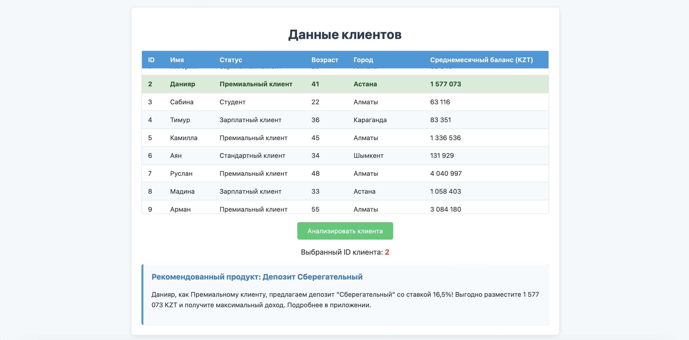

# Анализатор Рекомендаций для Клиентов

Этот проект представляет собой систему для анализа данных клиентов банка и формирования персональных рекомендаций по финансовым продуктам. Рекомендации включают в себя различные виды карт, депозитов и инвестиционных инструментов.

Система может быть запущена в трех различных режимах:
1.  **Веб-сервер (API)**: Запускает сервер FastAPI, который принимает ID клиента и возвращает рекомендацию в формате JSON.
2.  **Скрипт для одного клиента**: Анализирует данные конкретного клиента по его ID, переданному в качестве аргумента командной строки.
3.  **Скрипт для всех клиентов**: Последовательно анализирует данные всех клиентов из базы (ID с 1 по 60).

## Структура проекта

```
/
├── case1/
│   ├── clients.csv
│   └── ... (другие файлы с данными клиентов)
├── out/
│   └── recommendations_append.csv (файл с результатами)
├── server.py              # Основной файл с логикой и сервером
└── requirements.txt       # Файл с зависимостями
```

## Установка ⚙️

1.  Убедитесь, что у вас установлен Python 3.8 или выше.
2.  Клонируйте репозиторий или скачайте файлы проекта.
3.  Создайте и активируйте виртуальное окружение (рекомендуется):
    ```bash
    python -m venv venv
    source venv/bin/activate  # Для Linux/macOS
    venv\Scripts\activate     # Для Windows
    ```
4.  Установите все необходимые зависимости с помощью файла `requirements.txt`:
    ```bash
    pip install -r requirements.txt
    ```

## Запуск 🚀

Вы можете запустить проект в одном из трех режимов.

### 1. Запуск в режиме веб-сервера (FastAPI)

Этот режим идеально подходит для интеграции с веб-интерфейсом или другими сервисами.

1.  Откройте терминал в папке проекта.
2.  Выполните команду:
    ```bash
    uvicorn server:app --reload
    ```
    * `server`: имя вашего Python-файла (`server.py`).
    * `app`: объект `FastAPI`, созданный в вашем файле.
    * `--reload`: сервер будет автоматически перезагружаться при изменениях в коде.

3.  Сервер будет доступен по адресу `http://127.0.0.1:8000`. Вы можете отправлять на него `POST`-запросы или использовать интерактивную документацию API по адресу [http://127.0.0.1:8000/docs](http://127.0.0.1:8000/docs).


### 2. Запуск в режиме скрипта для одного клиента

Этот режим полезен для быстрой проверки или отладки логики для конкретного клиента.

1.  Откройте терминал в папке проекта.
2.  Выполните команду, указав ID нужного клиента через аргумент `-id` или `--client_id`.

    **Пример для клиента с ID=8:**
    ```bash
    python analyzer.py -id 8
    ```
3.  Результат анализа будет выведен в консоль, а также записан в файл `out/recommendations_append.csv`.

### 3. Запуск в режиме скрипта для всех клиентов

Этот режим используется для пакетной обработки всех клиентов в базе.

1.  Откройте терминал в папке проекта.
2.  Запустите скрипт без каких-либо аргументов:
    ```bash
    python analyzer.py
    ```
3.  Скрипт последовательно обработает всех клиентов с ID от 1 до 60. Результаты будут выводиться в консоль и добавляться в файл `out/recommendations_append.csv`.